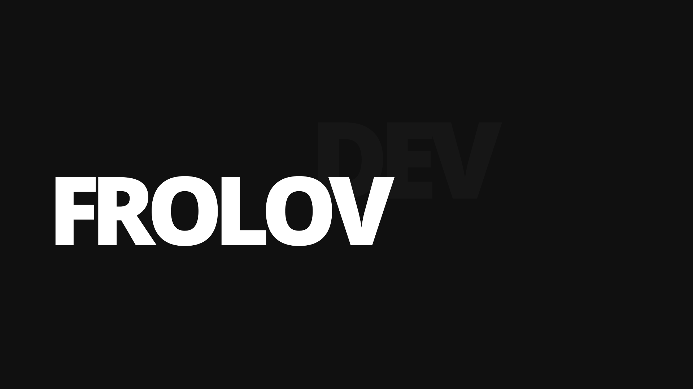
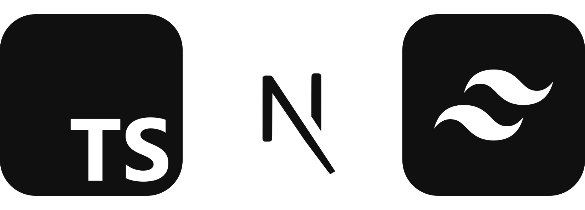
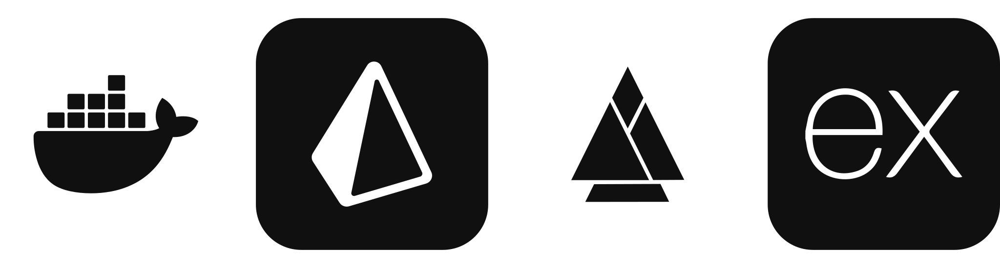

# Frolov Dev



Frolov Dev is a personal website for a full-stack developer, designed as a concise showcase of experience, services, and projects. It allows visitors to quickly understand the types of tasks I handle, such as web services, Telegram bots, automation, data scraping, landing pages, and other practical solutions.

The site features key sections: an introduction, areas of expertise, the technology stack, a portfolio, and a request form. The form allows users to describe their project idea, select the task type, specify the budget and urgency, provide contact details, and attach files containing technical specifications or reference materials. Once submitted, the request is saved to the database and sent as a message to a Telegram bot, ensuring it can be promptly reviewed and processed.

## Stack

<div align="left">
  
  <br />
  
</div>

## Launch

Copy the env files:

```bash
cp .env.example .env
cp frontend/.env.example frontend/.env
cp backend/.env.example backend/.env
```

Launch the project:

```bash
docker compose up -d --build
```

The website will be available at the following address:

```text
http://localhost
```

For development with hot reload, run:

```bash
docker compose -f docker-compose.yml -f docker-compose.dev.yml up --build
```

Frontend will also be available directly at `http://localhost:3000`, and the backend at `http://localhost:3001`.
